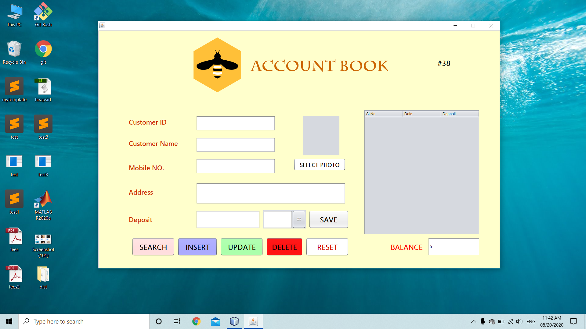
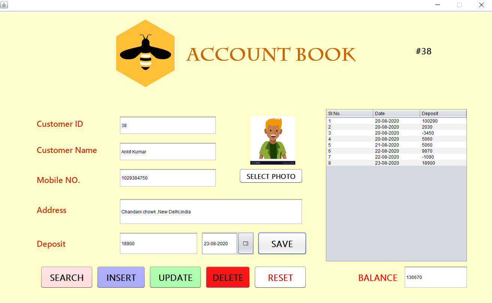

# AccountBook
Desktop Application for accounting that helps  keep track of daily transactions by digitizing ledger account book.\
 

## Brief Description
The project is a desktop application made usage of Java Swing Library for Graphical User Interface (GUI) and MySQL\
for back-end.With the help of this application, you can insert customer account which further can be updated and \
deleted from the server.The customer account will be initialized with the details provided along with a table \
which will keep track of the transactions made by the respective customer.With Reset button the application \
input fields will get back to its default value. Further any customer can be searched either by Id or Mobile\
No.,where customer details and Transaction history can be viewed.\
Fill the deposit amount and date along with either Id OR Mobile No. and click on "SAVE" button to make a new\
transaction. Final Balance of any customer can be seen at the bottom of transaction table.\
Number of registered customer is highlighted at the top-right corner.
 
 

#### License

This project is licensed under the MIT License

#### Acknowledgment

 Huge thanks to the awesome StackOverflow Community
